# 2302.10313v1

## Real-Time Speech Enhancement Using Spectral Subtraction

## with Minimum Statistics and Spectral Floor

Georgios Ioannides1 georgios.ioannides16@alumni.imperial.ac.uk and Vasilios Rallis1 vasilios.rallis98@gmail.com

### 1 Abstract

*Y*(*ω*) =*X*(*ω*)*−*ˆ*N*(*ω*) (3) An initial real-time speech enhancement method is pre- sented to reduce the effects of additive noise. The method However, since the phase of the noise is not known, only operates in the frequency domain and is a form of spec- the magnitude of the noise estimate ˆ*N*(*ω*) will be sub- tral subtraction. Initially, minimum statistics are used to tracted from*X*(*ω*) leaving the phase of*X*(*ω*) distorted by generate an estimate of the noise signal in the frequency the noise (4).

domain. The use of minimum statistics avoids the need

# arXiv:2302.10313v1  [eess.AS]  20 Feb 2023

for a voice activity detector (VAD) which has proven to be challenging to create [7]. As minimum statistics are ˆ*N*(*ω*) *Y*(*ω*) =*X*(*ω*)*−* used, the noise signal estimate must be multiplied by a   scaling factor before subtraction from the noise corrupted ˆ*N*(*ω*) speech signal can take place. A spectral floor is applied 1*−* =*X*(*ω*)   *X*(*ω*)  to the difference to suppress the effects of ”musical noise” [2]. Finally, a series of further enhancements are consid- =*X*(*ω*)*g*(*ω*) (4) ered to reduce the effects of residual noise even further.

These methods are compared using time-frequency plots An issue with simply implementing (4) is that if *g*(*ω*) is to create the final speech enhancement design.

negative for some frequency bins, the phase of those fre-

### 2 Introduction

quency bins will be shifted by *π* 2 radians. As stated by [3], Background additive noise that has distorted a speech the relative phases of two signal components is relevant if signal can degrade the performance of many real-world the two components are separated by less than a critical bandwidth. This critical bandwidth is close to 1*/*6th of digital communication systems.

Today, digital commu- nication systems are increasingly being used in noise en- an octave after 1kHz. Therefore, under some conditions, vironments such as vehicles, factories and airports. Sig- phase distortion might result in an audible distortion in nal Processing techniques are also used in brain modelling the time domain. A solution to this problem would be to applications[4]. Robustness to noise sensitivity have be- modify *g*(*ω*) to:

come key properties in any communication system.

In this work, a real-time spectral subtraction system will be   ˆ*N*(*ω*) implemented to reduce the background noise in a speech 0*,*1*−* *g*(*ω*) = max (5)   signal while leaving the speech itself intact. This is known *X*(*ω*)  as speech enhancement.

### 3 Basic Implementation

Throughout this work, *g*(*ω*) will be modified in search of an improvement in intelligibility of of the final signal **3.1** **High-level** **Overview** *y*(*t*). Ideally,*Y*(*ω*)*≈**S*(*ω*), thus, using the inverse Fourier In spectral subtraction, the assumption is that the speech transform, the original speech signal*s*(*t*) can be recovered.

signal *s*(*t*) has been distorted by a noise signal *n*(*t*) with The process is illustrated in Figure 1 their sum being denoted by *x*(*t*) (1).

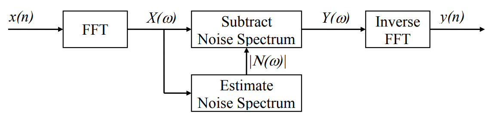

*x*(*t*) =*s*(*t*) +*n*(*t*) (1) In the frequency domain, these signals become:

*X*(*ω*) =*S*(*ω*) +*N*(*ω*) (2) Figure 1: Block diagram of spectral subtraction [8] where *X*(*ω*), *S*(*ω*) and *N*(*ω*) are the Fourier transforms of *x*(*t*), *s*(*t*) and *n*(*t*) respectively. Effectively, the spec- The assumption of additive noise implies that*n*(*t*) and*s*(*t*) are statistically independent [9]. This assumption can be tral subtraction method operates in the Fourier domain by attempting to subtract an estimate of*N*(*ω*) which will applied in most real-world situations as no knowledge of be denoted as ˆ*N*(*ω*) from *X*(*ω*), to produce a final signal the probability density function (PDF) or the frequency *Y*(*ω*) (3).

domain of the noise is required.

1Equal Contribution 1

<!-- Page 2 -->

**3.2** **Frame** **Processing** contain 256*/*4 = 64 new samples) For the system to be real-time, the speech signal*s*(*t*) must first be split into smaller sections so that the process-

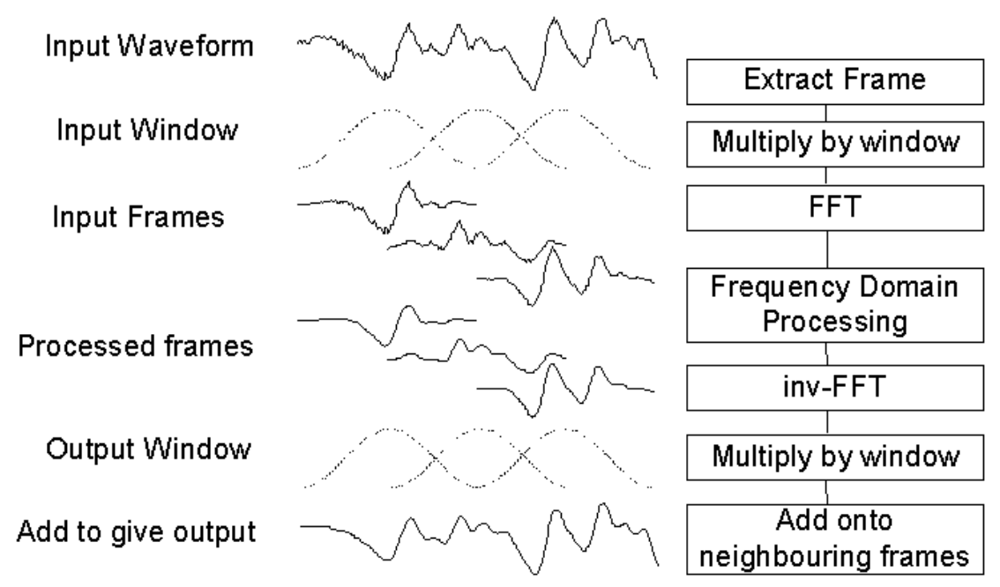

ing can take place before the entire signal has arrived.

These smaller sections are called frames and their size is denoted as *N*. For the basic implementation, *N* = 256.

It is critical that *N* is a power of 2 so that the radix-2 FFT algorithms can be used. This leads to a reduction in the time-complexity of the FFT algorithm from*O*(*N* 2) to *O*(*N*log(*N*)). The reduction in the run-time of the algo- rithm for large values of *N* (i.e. *N* *>* 100) is the critical for the system to be achievable in real-time.

However, the discontinuities at the edges of each frame will lead to spectral artifacts. To solve this issue, a win- dow is applied in the time domain before the FFT of the Figure 3: Overlap and add process [8] frame is computed. Nevertheless, by windowing *x*(*t*) in the time domain, the signal has been distorted; thus, as shown in Figure 2, the original time domain signal will As shown in Figure 3, another time domain window is not be recovered.

applied to *x*(*t*) after the Inverse Fast Fourier Transform (IFFT) of the function is taken. This second window is

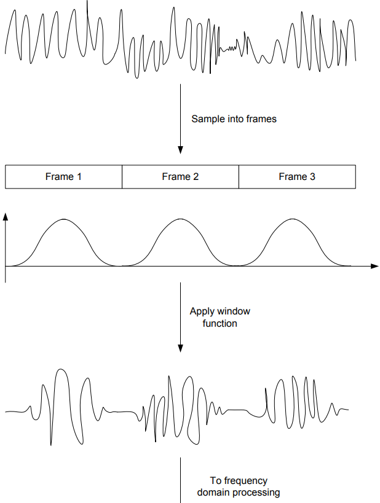

necessary as a modification in the frequency domain is equivalent to filtering in the time domain which might lead to discontinuities when the frames meet. In imple- mentations developed in this work, for both the input and output windows, the square root of the Hamming window was used (6). The Hamming window offers a relative first sidelobe amplitude level of -40.0dB Figure 4.

s (2*t*+ 1)*π* for *t*= 0*, ..., N**−*1 (6) 1*−*0*.*85185 cos *w*(*t*) = *N* 0

|Col1|Col2|Col3|Col4|Col5|Hamming Hanning|
|---|---|---|---|---|---|
||||||Hamming Hanning |
|||||||
|||||||
||||||Gaussian|
|||||||

Magnitude (dB) -50 -100 -150 0

0. 02
0. 04
0. 06
0. 08
0. 1

Normalized Frequency (cycles/sample) Figure 4: Frequency domain of Hamming, Hanning and Gaussian Windows Figure 2: Problem with simply applying window in the **3.3** **Noise** **Estimation** time domain [8] As mentioned previously, for spectral subtraction to be performed, an estimation ˆ*N*(*ω*) of the noise present in the To solve this, the individual frames can be overlapped so signal is required (7). One way of finding this estimate that the sum of overlapping windows is always 1.

The would be to use a Voice Activity Detector (VAD) which number of frames that overlap is known as the oversam- detects whether speech is present in the signal and then pling factor. The process for an oversampling factor of 2 take the average of all the frames where speech is not is shown in Figure 3. Note that for the basic implemen- present [2]. However, spectral subtraction based on VAD tation of the spectral subtraction algorithm, an oversam- is exceptionally difficult to make so an easier approach is pling factor of 4 was used instead (i.e. each frame will chosen [7].

2

<!-- Page 3 -->

For each frequency bin of *X*(*ω*), the minimum magnitude 10-3

1. 5

over the last 10 seconds is determined. This frame will be referred to as the Minimum Magnitude Spectral Estimate Amplitude (V) (MMSE) henceforth. Assuming that the speaker who is 1 being recorded will make a brief pause within these 10 sec- onds to take a breath, the MMSE will correspond to the

0. 5

minimum magnitude of the realization of the noise within the speech pauses in the last 10 seconds. As this estima- 0 0 1000 2000 3000 4000 tor will use the minimum of the noise realizations, it will Frequency (Hz) severely underestimate the average magnitude of the noise signal. For this reason, a compensating factor denoted by *α* must be introduced.

Since *x*(*t*) is sampled at 8kHz, Figure 5: MMSE over the past 1000 frames and each new frame contains 64 new samples (i.e. 8ms of new information), 1250 frames must be stored in mem- of three consecutive processed *Y*(*ω*) ory to find the MMSE. This is infeasible due to hardware The magnitude limitations of the system in use.

frames for *α* = 20 is plotted in Figure 6. Note that both peaks and valleys are present in all three frames.

A simplification can be made by storing just 4 frames de- noted as *M**i*(*ω*) where *i* = 1*, ..,*4. For each frame, *M*1(*ω*)

0. 15

is updated by:

Frame 1 Frame 2 Amplitude (V)

0. 1

Frame 3 *X*(*ω*) *, M*1(*ω*)

0. 05

*M*1(*ω*) = min (7) 0 0 1000 2000 3000 4000 Frequency (Hz) After 2.5 seconds (i.e. approximately 312 new frames), the frames are shifted and the new*M**i*(*ω*) takes the values of the previous *M**i**−*1, for *i* = 4*, ...,*2 while *M*1(*ω*) is set Figure 6: Magnitude of three consecutive processed frames *X*(*ω*) . The disadvantage of using this simplification to for *α*= 20 is that the MMSE memory (i.e.

how far into the past the minimum frequency bins will be searched for) will not be a constant 10 seconds since once the shift occurs, the By increasing the value of *α*, the broadband noise in the new MMSE will have an effective memory of 7.508 seconds frame will be suppressed while the effect of the musical which will grow until it reaches 10 seconds and then reset noise (i.e. the peaks) will be further enhanced since it will again. Nevertheless, this is a small compromise for such a not be masked by the broadband noise. The magnitude of three consecutive processed frames for *α* = 200 dramatic decrease in the amount of memory required.

*Y*(*ω*) **3.4** **The** **noise** **trade-off** is plotted in Figure 7. As expected, the peaks are more prevalent even though their amplitude has been decreased.

As explained in [1], one of the problems with the imple- mentation described above is the introduction of a new type of noise into *Y*(*ω*). This new type of noise will be referred to as musical noise.

To explain this new type Frame 1

0. 1

Frame 2 of noise, it is crucial to understand that there are peaks Amplitude (V) Frame 3 and valleys in the short-term power spectrum of the noise.

Both the frequency and amplitude of these peaks will vary

0. 05

randomly from frame to frame. When spectral subtraction takes place according to *g*(*ω*) (5), depending on the value of *α* more peaks or more valleys will remain in the mag- 0 *X*(*ω*) . The peaks will be nitude of the processed frame 0 1000 2000 3000 4000 Frequency (Hz) perceived as tones at a specific frequency. This frequency will change every frame, thus, for the implementation de- scribed above, the frequency of the tones will change every Figure 7: Magnitude of three consecutive processed frames 8ms. The valleys will be perceived as broadband noise.

for *α*= 200 A simulated example is described to gain a better un- derstanding. Using the MATLAB function randn, 1000 A solution to this musical noise problem, is to further modify *g*(*ω*) to introduce a new parameter *λ* which will frame realizations of length 256 are generated.

The be referred to as the spectral floor (8). Effectively, the MMSE over these 1000 frames is plotted in Figure 5.

3

<!-- Page 4 -->

parameter will be used to mask the musical noise with broadband noise (Figure 7).

Figure 9: Code to perform FFT on new frame   ˆ*N*(*ω*) As this is a real-time implementation, optimizations are required to decrease the run time of frame processing. One *λ,*1*−**α* *g*(*ω*) = max (8)   *X*(*ω*)  of the primary optimizations is to only process half of the frame once in the frequency domain. As the frame being processed is real in the time domain, the frequency do- main of the frame will be conjugate complex symmetric (9).

Frame 1

0. 1

Frame 2 Amplitude (V) Frame 3 *X**N**−**n* =*X**∗* (9) *n*

0. 05

where *X**n* is the value of the *N* point FFT at frequency bin *n* and *∗*is the complex conjugate operator.

0 Next, the magnitude of the current frame is computed 0 1000 2000 3000 4000 and used to implement the MMSE algorithm mentioned Frequency (Hz) previously.

Figure 8: Magnitude of three consecutive processed frames 1 //N.B. most of the frame processing is done *←**-* withing a for loop for *α*= 200 and *λ*= 0*.*1 2 //that takes advantage of the conjugate complex *←**-* symmetry.

3 //This greatly improves efficiency.

Since the MMSE is used as an estimate for the noise, the 4 for(k=0; k<FFTLEN/2; k++){ appropriate value (i.e. the one that leads to best intelligi- //Calculate magnitude of current frame 5 mag[k] = cabs(intermediate[k]);

bility of the speech) of *α* will increase with:

6 Figure 10: Computation of frame magnitude

1. The memory of the MMSE
2. The variance of the noise. This equivalent to the

1 //Check for possible MMSE elements in current *←**-* power of the zero mean noise.

frame 2 m1[k] = min(mag[k],m1[k]);

In this simulated example, the signal consisted of only Figure 11: Implementation of MMSE algorithm (1) noise; however, it must be underscored that if *α* is too large, distortion caused by the spectral subtraction will 1 //Calculate MMSE from MMSE buckets decrease the speech intelligibility.

2 mmse[k] = min(min(m1[k],m2[k]),min(m3[k],m4[k]));

Overall, through the above analysis, it is clear that the pa- Figure 12: Implementation of MMSE algorithm (2) rameters of spectral subtraction method used, must be ad- justed to achieve a balance between, musical noise, broad- 1 //Check if current MMSE bucket if full band noise and speech intelligibility. This intuition will be 2 if(++countMin >= BUCKET_FRAMES){ used in the next sections to further improve the current countMin = 0; //Reset the counter 3 implementation.

4 //Reset oldest MMSE bucket 5 **3.5** **Implementation** **in** **C** for(k=0; k<FFTLEN/2; k++) 6 The key parts of the C code for the basic implementation m4[k] = mag[k];

7 are described in the following section.

The frame that 8 //Swap buckets 9 must be processed is located in the inframe array. The temp = m4;

10 first step is to move the frame from the inframe array m4 = m3;

11 to the intermediate array and convert the elements m3 = m2;

12 m2 = m1;

of inframefromfloattocomplexwhich is astruct 13 m1 = temp;

14 defined in thecomplx.hheader file. The conversion from 15 } floattocomplexis required as the signature of thefft Figure 13: Implementation of MMSE algorithm (3) function is void fft(int N, complex*∗*X).

for (k=0;k<FFTLEN;k++) 1 Finally, the value of *g*(*ω*) (8) for the current frequency { 2 bin is computed and elements of the intermediate ar- inframe[k] = inbuffer[m] * inwin[k];

3 if (++m >= CIRCBUF) m=0; /* wrap if required *←**-* ray are overwritten accordingly.

4 */ 1 gw = max(lambda,(1-(alpha*mmse[k]/mag[k])));

} 5 6 Figure 14: Computation of *g*(*ω*) for single frequency bin /    * DO PROCESSING OF *←**-* 7 FRAME HERE     **/ 4

<!-- Page 5 -->

4

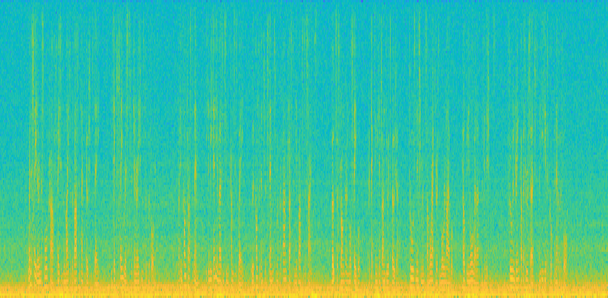

1 gw = max(lambda,(1-(alpha*mmse[k]/mag[k])));

3. 5

-40 3 Figure 15: Overwriting the elements of intermediate Power/frequency (dB/Hz) -60 Frequency (kHz)

2. 5

-80 2 -100

1. 5

1 -120 It must be noted that once the IFFT of the

0. 5

-140 intermediatearray is taken, only the real values of the 0 5 10 15 20 25 30 35 elements of intermediatewill be written tooutframe Time (secs) as any complex values will be due to finite precision effects.

Figure 18: Spectrogram of car1.wav 1 //Calculate the IFFT of the current frame 2 ifft(FFTLEN, intermediate);

3 4 //Copy real part of X[k] to the output frame 4

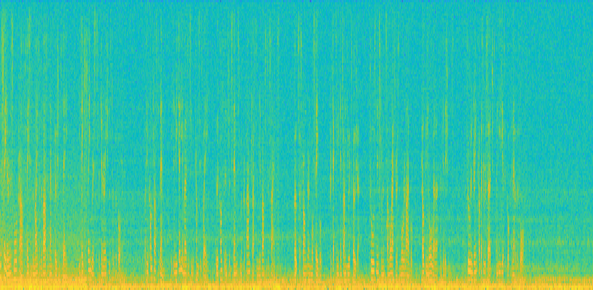

5 for(k=0; k<FFTLEN; k++)

3. 5

-40 outframe[k] = intermediate[k].r;

6 3 -60 Power/frequency (dB/Hz) Frequency (kHz)

2. 5

Figure 16: Writing the real values of intermediate to -80 2 outframe -100

1. 5

-120 1

0. 5

-140 **3.6** **Performance** **of** **the** **Basic** **Implemen-** 0 5 10 15 20 25 30 35 **tation** Time (secs) The performance of this basic implementation will be used as a benchmark to compare the enhancements that will be Figure 19: Spectrogram of car1.wavoutput with*α*= 20 introduced in the next section. To compare the different and *λ*= 0*.*05 (Basic Implementation) implementations, a selection of Waveform Audio Files (i.e.

.wav) containing ”the sailor passage” with different types of added noise (e.g. car, factory, helicopter) at different

### 4 Enhancements

noise levels were used as input to the system. To refer to In this sections various enhancements are made to the the different types of input their file names will be used basic implementation.

Not all enhancements were used (e.g. phantom2.wavfor added noise from the F15 phan- in the final implementation as some proved to have little tom aircraft at noise level 2).

The spectrogram of the effect in practice given their computational cost. The C- input with no added noise (i.e. clean.wav) is shown in code implementation for all of the enhancements can be Figure 17. The spectrogram of car1.wav in Figure 18.

found in the Appendix.

Through a visual inspection of the spectrogram, the car **4.1** **Low-pass** **filtering** **the** **magnitude** noise seems to have added broadband stationary noise at The first enhancement is simply to low-pass filter the mag- low frequencies (i.e. less that 300Hz). The spectrogram of of the frame. Note the the low-pass filter *X*(*ω*) nitude car1.wavafter processing, which will simply be referred in acting on consecutive frames rather than in the time to as ”the output,” is shown in Figure 19. As expected, domain. This was recommended in [7] [6]. The low-pass the basic spectral subtraction implementation has reduced filtering is done according to the difference equation (10) the noise in the signal; however, improvements can still be made.

+*kP**t**−*1(*ω*) *X*(*ω*) *P**t*(*ω*) = (1*−**k*) (10) 4

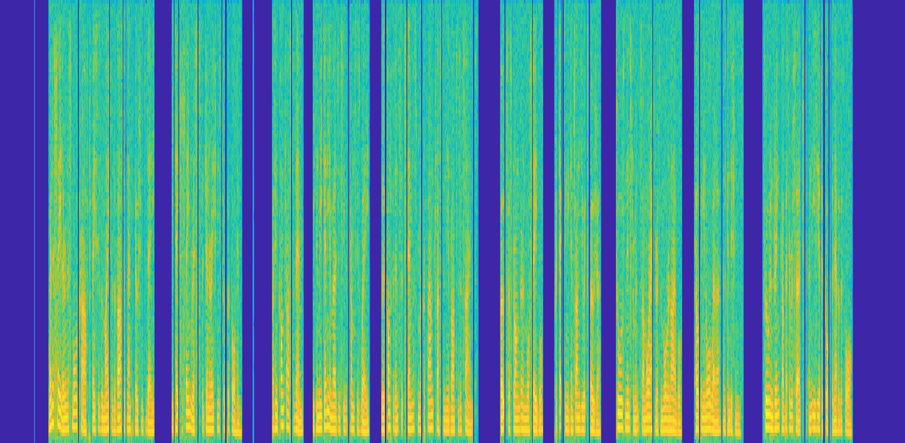

-40

3. 5

where*k* =*e**T/τ* is the z-plane pole for time constant*τ* and -60 3 Power/frequency (dB/Hz) frame rate *T* and *P**t*(*ω*) is the low-pass filtered input for Frequency (kHz)

2. 5

-80 *e**T/τ**<*1 for*T* *̸*= 0, the filter will frame*t*. Note the since 2 -100

1. 5

always be stable for any value of*τ*. This enhancement im- -120 1 proved significantly the output while *α* was reduced from -140

0. 5

20 to 2;*τ* was set empirically to 30ms which is in the range 0 suggested by [8]. The spectrogram of the output with the 5 10 15 20 25 30 35 Time (secs) above enhancement is shown in Figure 20. Surprisingly, even though the spectrum looks similar to Figure 19, it Figure 17: Spectrogram of clean.wav was perceived to be much clearer.

5

<!-- Page 6 -->

4

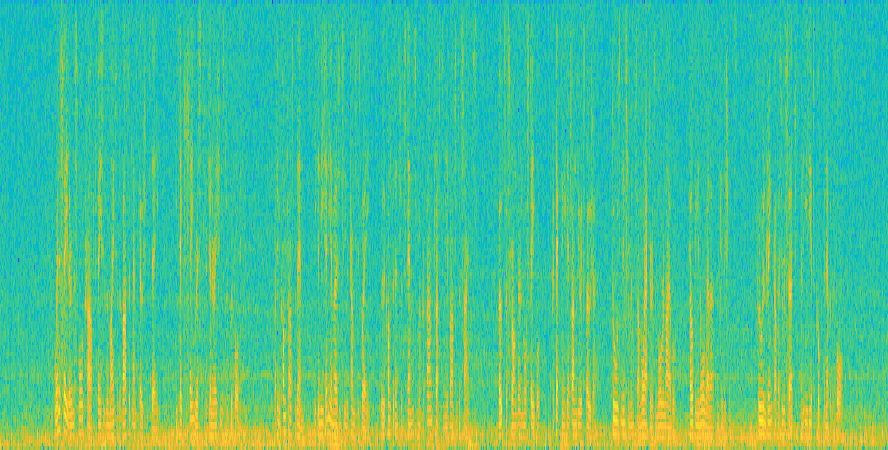

-40

3. 5

-60 3 Power/frequency (dB/Hz)   ˆ*N*(*ω*) ˆ*N*(*ω*) Frequency (kHz)

2. 5

-80 *,*1*−**α* *g*(*ω*) = max *λ* (11)   2 *X*(*ω*) *X*(*ω*)  -100

1. 5

-120 1   ˆ*N*(*ω*) *P*(*ω*)

0. 5

-140 *,*1*−**α* *g*(*ω*) = max *λ* (12)   0 *X*(*ω*) *X*(*ω*)  5 10 15 20 25 30 35 Time (secs)   ˆ*N*(*ω*) ˆ*N*(*ω*) Figure 20: Spectrogram car1.wav output with *α* = 2, *,*1*−**α* (13) *g*(*ω*) = max *λ*   *λ*= 0*.*05, *τ* = 0*.*03 (Enhancement 1) *P*(*ω*) *P*(*ω*)    ˆ*N*(*ω*) **4.2** **Low-pass** **filtering** **power** *λ,*1*−**α* *g*(*ω*) = max (14)   *P*(*ω*)  This enhancement is very similar to enhancement 1, ex- *X*(*ω*) , cept instead of low-pass filtering the magnitude 2 is low-pass filtered. Theoretically, this *X*(*ω*) the power makes sense since humans perceive power rather than magnitude. Furthermore, it’s expected that the optimal All of these enhancements were tested empirically, the best 2 will vary faster than *X*(*ω*) value of *τ* will decrease as performing one was (13) which is also the version of *g*(*ω*) *X*(*ω*) .

Empirically, the optimal value of *τ* was set to that is used in [1].

0. 025.

This is within the range specified by [8].

The **4.5** **Calculating** *g*(*ω*) **in** **the** **power** **domain** spectrogram of the output with the above enhancement This is yet another enhancement that modifies*g*(*ω*); how- is shown in Figure 21. The output was perceived to be of ever, in this case, the modification is different as*g*(*ω*) will higher quality than the output when using enhancement be computed in the power domain instead of the magni-

1. 

tude domain ( 15).

4 -40

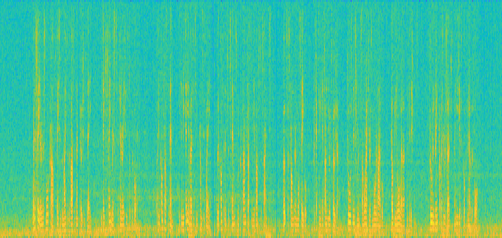

Power/frequency (dB/Hz) -60 Frequency (kHz) 3   v 2 -80   u ˆ*N*(*ω*) u 2   u -100 t1*−* *g*(*ω*) = max *λ,* *a* (15)     u *X*(*ω*)    -120  1 -140 0 5 10 15 20 25 30 35 Time (secs) As mentioned previously, humans perceive power rather than magnitude so there is theoretical justification for this Figure 21: Spectrogram car1.wav output with *α* = 2, enhancement. However, empirically, little difference was *λ*= 0*.*05, *τ* = 0*.*025 (Enhancement 2) perceived in the output signal with this enhancement be- ing very computationally expensive due to the powf and sqrtf functions that must be used.

**4.3** **Low-pass** **filtering** **the** **noise** **4.6** **Overestimate** *α* **at** **lower** **SNR** **fre-** In this enhancement, instead of low-pass filtering the mag- **quency** **bins** nitude of the frame, the MMSE is low-pass filtered. Theo- This enhancements adjusts the parameter *α* from frame retically, robustness of the system to non-stationary nose to frame depending on the SNR as suggested by [1]. The where there would be a abrupt change in the output once SNR from frame to frame will vary as the power of the the MMSE frames *M**i*(*ω*) shift. Empirically, there was a noise will be approximately the same for stationary noise noticeable difference when the input to the DSK was set while the power of the signal will vary.

For high SNR to factory1.wav and factory2.wav as they contain frames, increasing the value of *α* is not necessary and ”the sailor” passage with added factory noises at different will lead to a distortion in the speech signal.

For low levels.

SNR frames, a higher value *α* is necessary to suppress **4.4** **Using** **different** **values** **for** *g*(*ω*) the noise. Therefore, there is theoretical justification to This enhancement consists of implementing different ver- this enhancement. As suggested by [1], a piece wise linear sions of *g*(*ω*) shown below:

function was used to select the value of*α*(Figure 22) (16).

6

<!-- Page 7 -->

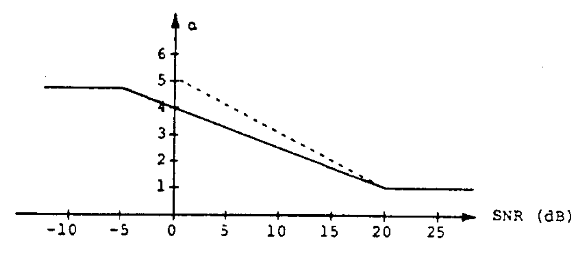

**4.7** **Adding** **the** *δ*(*F*) **term** In addition to adjusting the noise estimate, ˆ*N*(*ω*) based on the SNR ratio of each frequency bin, this enhancement aims to further adjust ˆ*N*(*ω*) based the analogue frequency, *F* that the frequency bins represents. This enhancement was introduced by [5] and uses a ”tweaking factor” *δ*(*F*) that can be individually set for each frequency bin. In the real-world, noise (e.g.

added car noise) is coloured and affects certain frequencies more than others. This is illustrated in Figure 24 which shows the spectrogram of Figure 22: Value of the compensation factor*α*versus SNR the added car noise. Note that the car noise is present of frame primarily at frequencies 0Hz*< F* *<*300Hz which explains the discrepancies between the SNRs of different frequency bins in Figure 23.

The function for the solid line in Figure 22 is:

4

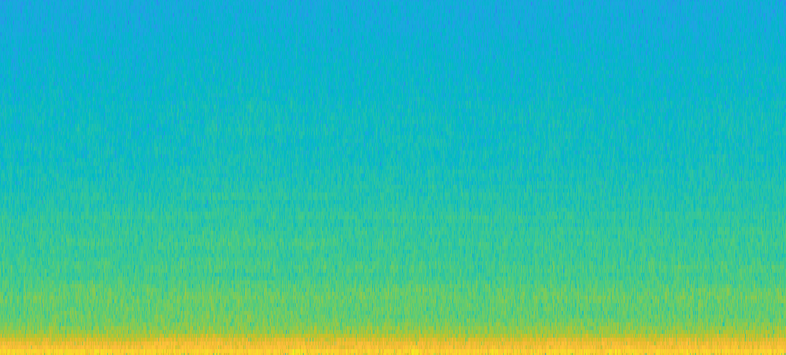

-40 Power/frequency (dB/Hz)  Frequency (kHz) 3 for *SNR <**−*5 5 -60    5*−*4 *α*(*SNR*) = (16) for *−*5*≤**SNR**≤*20 20*SNR* -80 2 -100  1 for *SNR >*1   -120 1 -140 0 Even though in [1], this enhancement was only performed 5 10 15 20 25 30 35 with a frame by frame granularity (i.e.

the value of *α* Time (secs) will change from frame to frame; however, it will remain constant within a frame) the enhancement was further Figure 24: Spectrogram of added car noise in car1.wav modified to allow for *α* to change with a frequency bin granularity which was used by [5].

The justification of this is that noise does not effect the speech signal in the frequency domain uniformly. This is illustrated in Figure The *δ*(*F*) terms adds an additional degree of freedom to 22 which shows the SNR ratios of four linearly space fre- the noise subtraction level of each frequency and modifies quency bins across consecutive frames for the input cor- (8) slightly to the form shown in (17) rupted by the added car noise. Bin 1 has a lower SNR across most frames as it corresponds to the very low fre- quencies ( *<*10Hz) which is where the car noise is mostly present. The SNRs between different frequency bins differ   ˆ*N*(*ω*) substantially with difference being greater than 100dB for *λ,*1*−**δ*(*F*)*α*(*SNR*) *g*(*ω*) = max (17)   *X*(*ω*) some frames. Note the if the slope of the piece-wise lin-  ear function (16) is increased, then the temporal dynamic range of the signal will also increase substantially leading to a distorted output. Empirically, the slope used in [1], was confirmed to have a good performance so it was not The values of *δ*(*F*) where determined empirically and set modified.

to:

100 Bin #1 Bin #2  50 1 0*Hz* *< F* *<*1*kHz* Bin #3    SNR (dB) Bin #4 *δ*(*F*) = (18) 1*kHz* *≤**F* *<*2*kHz* 2*.*5 0  2*kHz* *≤**F* 1*.*5   -50 -100 0 20 40 60 80 100 120 140 These values match the ones used in [5]. The addition of Frame number the delta term, lead to a significant increase in the intelligi- bility of the output especially when dealing with added he- Figure 23: SNR ratios of four linearly spaced frequency licopter noise. The spectrogram of added helicopter noise bins across consecutive frames is shown in Figure 25 7

<!-- Page 8 -->

timization, this enhancement is very computationally de- 4 -50

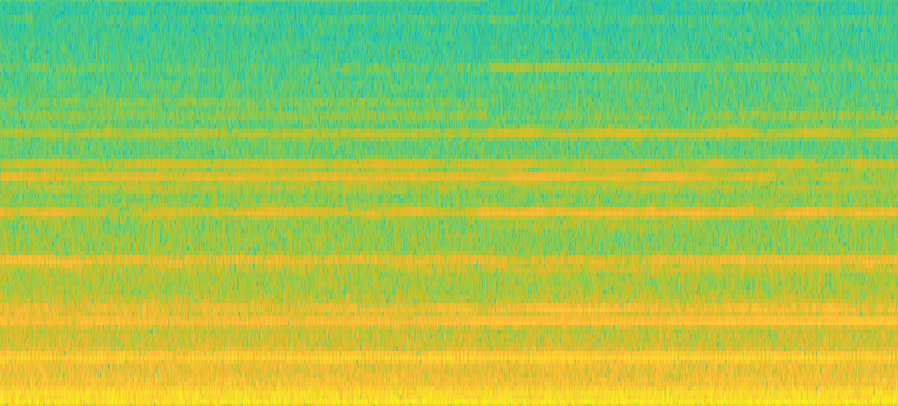

manding and could not be implemented in parallel with Power/frequency (dB/Hz) the enhancements mentioned thus far. For this reason, it Frequency (kHz) 3 was not included in the final implementation.

-100 2 **4.10** **Reduce** **the** **MMSE** **Memory** This enhancement aims to increase the responsiveness of 1 the system to non-stationary noise by reducing the MMSE memory.

Reducing the MMSE memory is also benefi- -150 0 cial from a computational point of view; however, if the 5 10 15 20 25 30 35 Time (secs) speaker continues to produce sound for more than the MMSE memory (measured in seconds), the noise estimate Figure 25:

Spectrogram of added helicopter noise in that will be made will be extremely high as segments of lynx1.wav speech have effectively been misclassified as noise. This will lead to a serious distortion in the speech signal.

**4.11** **Changing** **the** **windowing** **function** A final enhancement that was considered was to use a dif- 4 -40

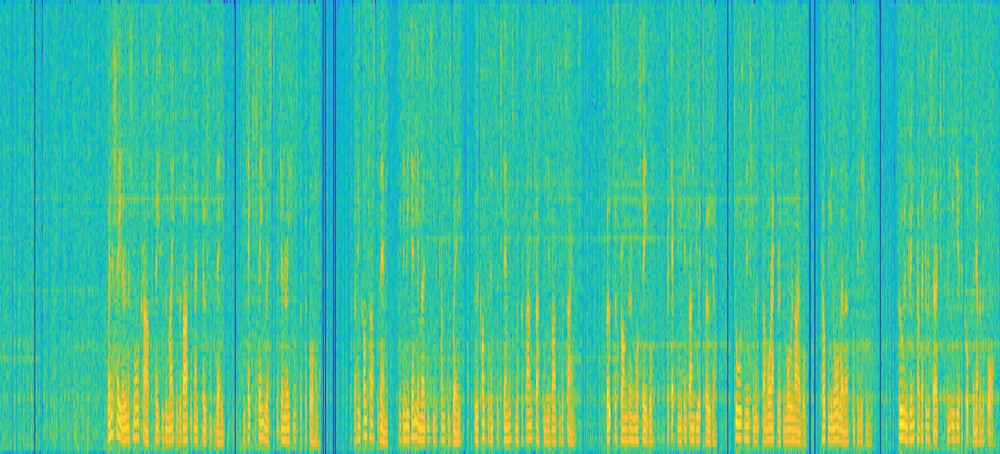

ferent windowing function. As mentioned in section 3.2, Power/frequency (dB/Hz) -60 Frequency (kHz) 3 in the implementations thus far, the Hamming window -80 was used to mitigate the effects of spectral artifacts in the 2 frequency domain. Other windows that were considered -100 were the Hanning, Gaussian and Black-Harris (3-term).

-120 1 Out of these windows, the Hanning performed the best -140 which might be due to it’s higher spectral roll-off(Figure 0

4. 

5 10 15 20 25 30 35 Time (secs)

### 5 Final Implementation and Re- sults

Figure 26: Spectrogram of lynx1.wavoutput with*δ*(*F*) set to (18) (Enhancement 7) In the final implementation a compromise between com- putational complexity and system performance was made **4.8** **Using** **different** **frame** **lengths** when choosing which enhancements to include. Enhance- ments 4.2, 4.3, 4.4, 4.6, 4.7 and 4.11 were included in the By changing the frame length, the time and frequency res- final implementation. Enhancement 4.5 and 4.9 were very olution of the implementation can be changed. A larger computationally demanding and could not be included to- frame length will effectively increase the frequency reso- gether with other enhancements while the rest of the en- lution of each frame while decreasing the frequency reso- hancements did not improve the final output or, in some lution and vice versa. As mentioned previously, the basic case, lead to worse performance. The input and output implementation had a frame length of 256 samples and SNR levels for the final implementation is shown in Figure a sampling frequency of 8kHz. Thus each frame consists

27. The final implementation managed to reduce the noise

of 32ms of speech.

A shorter frame length resulted in significantly for all inputs; however, it performs best when ”roughness” in the speech while a longer frame length lead the original signal has a high original SNR level. It had to ”slurred” speech. These results agree with [8]. Over- the worse improvement in SNR with the phantom4.wav all, the ideal frame length was found to be around 28ms.

input were it only managed to achieved a 5.98dB improve- The frame length was adjusted by changing the FFTLEN ment.

definition in the C code.

**4.9** **Residual** **Noise** **Reduction** This enhancement attempts to remove some of the musical 15 Original SNR noise by taking advantage of the frame to frame random- 10 Final SNR ness [2]. Effectively, as mentioned previously, the musical SNR (dB) 5 noise is due to the formation of peaks in the magnitude spectrum which will appear at a random amplitude and 0 frequency for each frame.

Therefore, the musical noise -5 can be suppressed by replacing the frequency bins of the current frame with the minimum frequency bins from the -10 previous and next frame.

factory1 factory2 lynx1 lynx2 phantom1 phantom2 phantom4 car1 *X**i**−*1(*ω*) *,* *,* = min *X**i*+1(*ω*) *X**i*(*ω*) *X**i*(*ω*) (19) Figure 27: Improvement in SNR levels with final imple- mentation However, even with the complex conjugate symmetric op- 8

<!-- Page 9 -->

### 6 Conclusion

[4] Georgios Ioannides, Ioannis Kourouklides, and Alessandro Astolfi. “Spatiotemporal dynamics in A real-time speech enhancement system was implemented spiking recurrent neural networks using modified-full- based on the spectral subtraction technique. Different en- FORCE on EEG signals”. In: *Scientific* *Reports* 12 hancements were considered and their performance was (Feb. 2022), p. 2896. doi: 10.1038/s41598-022- evaluated based on extensive listening tests, spectrograms 06573-1.

and SNR comparisons. The final system manages to re- [5] Sunil Kamath and Philipos Loizou. “A multi-band duce the noise present in the output signal substantially spectral subtraction method for enhancing speech while achieving a compromise between broadband noise, corrupted by colored noise.” In:*ICASSP*. Vol. 4. Cite- musical noise and speech intelligibility. Nevertheless, the seer. 2002, pp. 44164–44164.

system struggles to deal with very low SNR inputs. To [6] P Lockwood, J Boudy, and M Blanchet. “Non-linear deal with these types of inputs, other more recent noise spectral subtraction (NSS) and hidden Markov mod- reduction techniques such as Wiener filters or signal sub- els for robust speech recognition in car noise envi- space approaches could be used.

ronments”. In:*[Proceedings]* *ICASSP-92:* *1992* *IEEE*

### References

*International* *Conference* *on* *Acoustics,* *Speech,* *and* *Signal* *Processing*. Vol. 1. IEEE. 1992, pp. 265–268.

[1] Michael Berouti, Richard Schwartz, and John [7] Rainer Martin. “Spectral subtraction based on mini- Makhoul. “Enhancement of speech corrupted by mum statistics”. In: *power* 6 (1994), p. 8.

acoustic noise”. In: *ICASSP’79.* *IEEE* *International* [8] Paul D. Mitcheson. *Project:* *Speech* *Enhancement*.

*Conference on Acoustics, Speech, and Signal Process-* Imperial College London.

*ing*. Vol. 4. IEEE. 1979, pp. 208–211.

[9] Lizhong Zhen and Robert Gallager. *6.450* *Principles* [2] Steven Boll. “Suppression of acoustic noise in speech *of* *Digital* *Communications* *I.* Accessed: 2019-03-07.

using spectral subtraction”. In: *IEEE* *Transactions* Massachusetts Institute of Technology: MIT Open- *on* *acoustics,* *speech,* *and* *signal* *processing*

27. 2

CourseWare, 2006. url: https://ocw.mit.edu/ (1979), pp. 113–120.

courses / electrical - engineering - and - [3] William M Hartmann.*Signals, sound, and sensation*.

computer-science/6-450-principles-of- Springer Science & Business Media, 2004.

digital - communications - i - fall - 2006 / lecture-notes/book_7.pdf.

### Appendix

1 /              * DEPARTMENT OF ELECTRICAL AND ELECTRONIC ENGINEERING 2 IMPERIAL COLLEGE LONDON 3 4 EE 3.19: Real Time Digital Signal Processing 5 Dr Paul Mitcheson and Daniel Harvey 6 7 PROJECT: Frame Processing 8 9  *** ENHANCE. C    10 Shell for speech enhancement 11 12 Demonstrates overlap-add frame processing (interrupt driven) on the DSK.

13 14               * 15 By Danny Harvey: 21 July 2006 16 Updated for use on CCS v4 Sept 2010 17               / 18 19 /* You should modify the code so that a speech enhancement project is built * 20 on top of this template.

* 21 */ 22 23 /      Pre-processor statements      / 24 // library required when using calloc 25 #include <stdlib.h> 26 // Included so program can make use of DSP/BIOS configuration tool.

27 #include "dsp_bios_cfg.h" 28 29 /* The file dsk6713.h must be included in every program that uses the BSL.

This example also includes dsk6713_aic23.h because it uses the 30 AIC23 codec module (audio interface). */ 31 32 #include "dsk6713.h" 33 #include "dsk6713_aic23.h" 34 35 // math library (trig functions) 36 #include <math.h> 9

<!-- Page 10 -->

37 38 /* Some functions to help with Complex algebra and FFT. */ 39 #include "cmplx.h" 40 #include "fft_functions.h" 41 42 // Some functions to help with writing/reading the audio ports when using interrupts.

43 #include <helper_functions_ISR.h> 44 45 #define WINCONST 0.85185 /* 0.46/0.54 for Hamming window */ 46 #define FSAMP 8000.0 /* sample frequency, ensure this matches Config for AIC */ 47 #define FFTLEN 256 /* fft length = frame length 256/8000 = 32 ms*/ 48 #define NFREQ (1+FFTLEN/2) /* number of frequency bins from a real FFT */ 49 #define OVERSAMP 4 /* oversampling ratio (2 or 4) */ 50 #define FRAMEINC (FFTLEN/OVERSAMP) /* Frame increment */ 51 #define CIRCBUF (FFTLEN+FRAMEINC) /* length of I/O buffers */ 52 53 #define OUTGAIN 16000.0 /* Output gain for DAC */ 54 #define INGAIN (1.0/16000.0) /* Input gain for ADC */ 55 56 // PI defined here for use in your code 57 #define PI 3.141592653589793 58 #define TFRAME (FRAMEINC/FSAMP) /* time between calculation of each frame */ 59 60 //Number of frames in a Minimum Magnitude Spectrum Estimate Bucket (MMSE Bucket) 61 #define BUCKET_FRAMES 312 62 63 //Define constants to select noise removal algorithm 64 //LOW_PASS_MAGNITUDE is used to Enable (1) or Disable (0) the low-pass filtering 65 //of the spectral magnitude. Please see report for more information.

66 #define LOW_PASS_MAGNITUDE 1 67 //LOW_PASS_NOISE is used to Enable(1) or Disable(0) the low-pass filtering 68 //of the Minimum Magnitude Spectral Estimate (MMSE). The MMSE is an estimator for the noise 69 //in the signal. Please see report for more information.

70 #define LOW_PASS_NOISE 0 71 //USE_MAGNITUDE_SQUARED is used to Enable(1) or Disable(0) the computation of 72 //square magnitude (i.e. spectral power) before applying the low-pass filer.

73 #define USE_MAGNITUDE_SQUARED 1 74 //Change the value of alpha at runtime according to the SNR of the signal 75 #define USE_DYNAMIC_ALPHA 1 76 //Select different G(w) to use.For values of G_OMEGA >= 3 some 77 //prerequisits apply. If these have not been selected by the user, 78 //the compilation will fail and an approriate error is 79 //presented. This is used to improve robustness.

80 #define G_OMEGA 3 81 //USE_RESIDUAL_NOISE_REDUCTION is used to Enable(1) or Disable(0) the 82 //residual noise reduction algorithm as a way to remove the musical noise.

83 #define RESIDUAL_NOISE_REDUCTION 0 84 //DELTA_TERM is used to Enable(1) or Disable(0) the additional delta term 85 //for adjusting the noise estimator based on the frequency bin 86 #define DELTA_TERM 1 87 88 /     * Global declarations      **/ 89 90 /* Audio port configuration settings: these values set registers in the AIC23 audio interface to configure it. See TI doc SLWS106D 3-3 to 3-10 for more info. */ 91 92 DSK6713_AIC23_Config Config = { \ /            / 93 /* REGISTER FUNCTION SETTINGS */ 94 /            /\ 95 0x0017, /* 0 LEFTINVOL Left line input channel volume 0dB */\ 96 0x0017, /* 1 RIGHTINVOL Right line input channel volume 0dB */\ 97 0x01f9, /* 2 LEFTHPVOL Left channel headphone volume 0dB */\ 98 0x01f9, /* 3 RIGHTHPVOL Right channel headphone volume 0dB */\ 99 0x0011, /* 4 ANAPATH Analog audio path control DAC on, Mic boost 20dB*/\ 100 0x0000, /* 5 DIGPATH Digital audio path control All Filters off */\ 101 0x0000, /* 6 DPOWERDOWN Power down control All Hardware on */\ 102 0x0043, /* 7 DIGIF Digital audio interface format 16 bit */\ 103 0x008d, /* 8 SAMPLERATE Sample rate control 8 KHZ-ensure matches FSAMP */\ 104 0x0001 /* 9 DIGACT Digital interface activation On */\ 105 /            / 106 107 };

108 109 // Codec handle:- a variable used to identify audio interface 110 DSK6713_AIC23_CodecHandle H_Codec;

10

<!-- Page 11 -->

111 112 float *inbuffer, *outbuffer;

/* Input/output circular buffers */ 113 float *inframe, *outframe;

/* Input and output frames */ 114 float *inwin, *outwin;

/* Input and output windows */ 115 float ingain, outgain;

/* ADC and DAC gains */ 116 float cpufrac;

/* Fraction of CPU time used */ 117 volatile int io_ptr=0;

/* Input/ouput pointer for circular buffers */ 118 volatile int frame_ptr=0;

/* Frame pointer */ 119 120 //Inermediate frame on which processing is done 121 complex *intermediate;

122 123 //Minimum Magnitude Spectrum Estimate (MMSE) Buckets 124 float* m1;

125 float* m2;

126 float* m3;

127 float* m4;

128 129 //Magnitude 130 float *mag;

131 132 //Parameters of g(w) 133 float alpha = 20;//16;

134 float lambda = 0.05;

135 136 //MMSE 137 float* mmse;

138 139 #if LOW_PASS_MAGNITUDE == 1 //Low-pass filtered version of mag(X) or mag(X)ˆ2 140 //N.B. This array is used to store both the previous frames 141 //low-pass filtered estimate and the current low-pass filtered 142 //estimate. This saves memory 143 float* lpfMag;

144 145 //Parameter used for low-pass filtering mag(X) 146 float tau = 30e-3;

147 148 #endif 149 150 #if USE_MAGNITUDE_SQUARED == 1 //Low-pass filtered estimate of mag(X)ˆ2 151 float* lpfMagSquared;

152 153 #endif 154 155 #if LOW_PASS_NOISE == 1 //Parameter used for low-pass filtering mmse (i.e. mag(N)) 156 float tauNoise = 80e-3;

157 158 #endif 159 160 #if USE_DYNAMIC_ALPHA == 1 //Parameters for scalling of alpha with SNR 161 float alphaMax = 10;

162 float alphaMin = 1;

163 float a0 = 6;

164 float s = 0.001;

165 166 #endif 167 168 #if RESIDUAL_NOISE_REDUCTION == 1 //Buffers for previous, current and next magnitude spectrum 169 //Y_Next does not have to be allocated as Y_Next will be the value 170 //currently calculated 171 complex* Y_Prev;

172 complex* Y_Curr;

173 174 #endif 175 176 /     * Function prototypes      */ 177 178 void init_hardware(void);

/* Initialize codec */ 179 void init_HWI(void);

/* Initialize hardware interrupts */ 180 void ISR_AIC(void);

/* Interrupt service routine for codec */ 181 void process_frame(void);

/* Frame processing routine */ 182 183 //Returns max of two floats 184 float max(const float a, const float b);

11

<!-- Page 12 -->

185 //Returns min of two floats 186 float min(const float a, const float b);

187 188 /       Main routine       / 189 void main() 190 { int k; // used in various for loops 191 192 193 /* Initialize and zero fill arrays */ 194 inbuffer = (float *) calloc(CIRCBUF, sizeof(float)); /* Input array */ 195 outbuffer = (float *) calloc(CIRCBUF, sizeof(float)); /* Output array */ 196 inframe = (float *) calloc(FFTLEN, sizeof(float));

/* Array for processing*/ 197 outframe = (float *) calloc(FFTLEN, sizeof(float));

/* Array for processing*/ 198 inwin = (float *) calloc(FFTLEN, sizeof(float));

/* Input window */ 199 outwin = (float *) calloc(FFTLEN, sizeof(float));

/* Output window */ 200 201 //Frequency domain 202 intermediate = (complex *) calloc(FFTLEN, sizeof(complex));

203 204 //MMSE Buckets 205 m1 = (float *) calloc(FFTLEN/2, sizeof(float));

206 m2 = (float *) calloc(FFTLEN/2, sizeof(float));

207 m3 = (float *) calloc(FFTLEN/2, sizeof(float));

208 m4 = (float *) calloc(FFTLEN/2, sizeof(float));

209 210 //Initialize memory to FLT_MAX (i.e. max value that float can take) 211 for(k=0; k<FFTLEN/2; ++k){ 212 m1[k] = FLT_MAX;

213 m2[k] = FLT_MAX;

214 m3[k] = FLT_MAX;

215 m4[k] = FLT_MAX;

216 } 217 218 //Magnitude of frequency domain 219 mag = (float *) calloc(FFTLEN/2, sizeof(float));

220 221 #if LOW_PASS_MAGNITUDE == 1 222 //Low-pass filtered estimate of current/previous frame 223 lpfMag = (float *) calloc(FFTLEN/2, sizeof(float));

224 #endif 225 226 #if USE_MAGNITUDE_SQUARED == 1 227 //Declare point to array to hold the squared magnitude values 228 lpfMagSquared = (float *) calloc(FFTLEN/2, sizeof(float));

229 #endif 230 231 #if RESIDUAL_NOISE_REDUCTION == 1 232 //Define arrays for previous, current and next magnitude spectrum.

233 //Y_Next does not have to be allocated as Y_Next will be the value 234 //currently calculated 235 Y_Prev = (complex *) calloc(FFTLEN, sizeof(complex));

236 Y_Curr = (complex *) calloc(FFTLEN, sizeof(complex));

237 #endif 238 239 240 //Allocating memory (i.e. defining) memory for 241 /* initialize board and the audio port */ 242 init_hardware();

243 244 /* initialize hardware interrupts */ 245 init_HWI();

246 247 248 /* initialize algorithm constants */ 249 for (k=0;k<FFTLEN;k++) 250 { 251 inwin[k] = sqrt((1.0-WINCONST*cos(PI*(2*k+1)/FFTLEN))/OVERSAMP);

252 outwin[k] = inwin[k];

253 } 254 ingain=INGAIN;

255 outgain=OUTGAIN;

256 257 /* main loop, wait for interrupt */ 258 12

<!-- Page 13 -->

while(1) process_frame();

259 260 } 261 262 /       init_hardware()      ***/ 263 void init_hardware() 264 { // Initialize the board support library, must be called first 265 DSK6713_init();

266 267 // Start the AIC23 codec using the settings defined above in config 268 H_Codec = DSK6713_AIC23_openCodec(0, &Config);

269 270 /* Function below sets the number of bits in word used by MSBSP (serial port) for 271 receives from AIC23 (audio port). We are using a 32 bit packet containing two 272 16 bit numbers hence 32BIT is set for receive */ 273 MCBSP_FSETS(RCR1, RWDLEN1, 32BIT);

274 275 /* Configures interrupt to activate on each consecutive available 32 bits 276 from Audio port hence an interrupt is generated for each L & R sample pair */ 277 MCBSP_FSETS(SPCR1, RINTM, FRM);

278 279 /* These commands do the same thing as above but applied to data transfers to the 280 audio port */ 281 MCBSP_FSETS(XCR1, XWDLEN1, 32BIT);

282 MCBSP_FSETS(SPCR1, XINTM, FRM);

283 284 285 286 } 287 /       init_HWI()       **/ 288 void init_HWI(void) 289 { IRQ_globalDisable();

// Globally disables interrupts 290 IRQ_nmiEnable();

// Enables the NMI interrupt (used by the debugger) 291 IRQ_map(IRQ_EVT_RINT1,4);

// Maps an event to a physical interrupt 292 IRQ_enable(IRQ_EVT_RINT1);

// Enables the event 293 IRQ_globalEnable();

// Globally enables interrupts 294 295 296 } 297 298 /     ** process_frame()       */ 299 void process_frame(void) 300 { int k, m;

301 int io_ptr0;

302 303 //If low-pass magnitude enhancement is selected 304 #if LOW_PASS_MAGNITUDE == 1 305 //Defining parameter used for low-pass filtering mag(X) 306 float kFrame;

307 #endif 308 309 //If low-pass noise magnitude enhancement is selected 310 #if LOW_PASS_NOISE == 1 311 //Defining parameter used for low-pass filtering mmse (i.e. mag(N)) 312 float kFrameNoise;

313 #endif 314 315 #if DELTA_TERM == 1 316 //Define the float to hold the delta term 317 float delta;

318 #endif 319 320 //Number of frames in m1 (i.e. the current MMSE bucket) 321 static int countMin = 0;

322 323 //Temporary pointer to swap minimum frame 324 float *temp;

325 326 //G(w) function used in noise subtraction part 327 float gw;

328 329 //If dynamic alpha enhancement is selected 330 #if USE_DYNAMIC_ALPHA 331 //Variable to store SNR for varible alpha 332 13

<!-- Page 14 -->

float snr;

333 #endif 334 335 //Minimum mag(Y_Prev, Y_Curr, Y_Next) 336 float minMag;

337 338 //If low-pass magnitude enhancement is selected 339 #if LOW_PASS_MAGNITUDE == 1 340 //Assigning value to parameter used for low-pass filtering mag(X) 341 //N.B. Use expf that calculates float instead of double to make 342 //computation faster 343 kFrame = expf(-TFRAME/tau);

344 #endif 345 346 //If low-pass noise magnitude enhancement is selected 347 #if LOW_PASS_NOISE == 1 348 //Assigning value to parameter used for low-pass filtering mmse 349 //N.B. Use expf that calculates float instead of double to make 350 //computation faster 351 kFrameNoise = expf(-TFRAME/tauNoise);

352 #endif 353 354 /* work out fraction of available CPU time used by algorithm */ 355 cpufrac = ((float) (io_ptr & (FRAMEINC - 1)))/FRAMEINC;

356 357 /* wait until io_ptr is at the start of the current frame */ 358 while((io_ptr/FRAMEINC) != frame_ptr);

359 360 /* then increment the framecount (wrapping if required) */ 361 if (++frame_ptr >= (CIRCBUF/FRAMEINC)) frame_ptr=0;

362 363 /* save a pointer to the position in the I/O buffers (inbuffer/outbuffer) where the 364 data should be read (inbuffer) and saved (outbuffer) for the purpose of processing */ 365 io_ptr0=frame_ptr * FRAMEINC;

366 367 /* copy input data from inbuffer into inframe (starting from the pointer position) */ 368 369 m=io_ptr0;

370 for (k=0;k<FFTLEN;k++) 371 { 372 inframe[k] = inbuffer[m] * inwin[k];

373 if (++m >= CIRCBUF) m=0; /* wrap if required */ 374 } 375 376 /    * DO PROCESSING OF FRAME HERE     **/ 377 378 //Copy the contents of inframe to intermediate 379 //Convert to complex for fft function 380 for(k=0; k<FFTLEN; k++) 381 intermediate[k] = cmplx(inframe[k],0);

382 383 //Calculate the FFT of the current frame 384 fft(FFTLEN, intermediate);

385 386 //N.B. most of the frame processing is done withing a for loop 387 //that takes advantage of the conjugate complex symmetry.

388 //This greatly improves efficiency.

389 for(k=0; k<FFTLEN/2; k++){ 390 //Calculate magnitude of current frame 391 mag[k] = cabs(intermediate[k]);

392 393 //If low-pass magnitude enhancement is selected 394 #if LOW_PASS_MAGNITUDE == 1 395 #if USE_MAGNITUDE_SQUARED == 1 396 //N.B. Use powf that calculates float instead of double to make 397 //computation faster 398 lpfMagSquared[k] = (1-kFrame)*powf(mag[k],2) + kFrame*lpfMagSquared[k];

399 //Save the low-passed filtered magnitude in a different array which is needed later 400 lpfMag[k] = sqrtf(lpfMagSquared[k]);

401 #else 402 //Compute low-pass filtered magnitude 403 lpfMag[k] = (1-kFrame)*mag[k] + kFrame*lpfMag[k];

404 #endif 405 #endif 406 14

<!-- Page 15 -->

407 //If low-pass magnitude enhancement is selected 408 #if LOW_PASS_MAGNITUDE == 1 409 //Check for possible MMSE elements in current frame 410 m1[k] = min(lpfMag[k],m1[k]);

411 #else 412 //Check for possible MMSE elements in current frame 413 m1[k] = min(mag[k],m1[k]);

414 #endif 415 416 #if LOW_PASS_NOISE == 1 417 //Calculate the low-pass filetered estimate of mmse (i.e. mag(N)) 418 mmse[k] = (1-kFrameNoise)*min(min(m1[k],m2[k]),min(m3[k],m4[k])) + kFrameNoise*mmse[k];

419 #else 420 //Calculate MMSE from MMSE buckets 421 mmse[k] = min(min(m1[k],m2[k]),min(m3[k],m4[k]));

422 #endif 423 424 #if USE_DYNAMIC_ALPHA == 1 425 //Calculate SNR 426 snr = 20*log10f(lpfMag[k]/mmse[k]);

427 428 //Implement piecewise scalling for alpha 429 alpha = a0 - snr*s;

430 431 //Check if alpha has exceeded the predefined limits 432 if(alpha > alphaMax) 433 alpha = alphaMax;

434 else if(alpha < alphaMin) 435 alpha = alphaMin;

436 #endif 437 438 #if DELTA_TERM == 1 439 //Compute the delta term based on the piecewise function 440 if(k < 32) delta = 1;

441 else if(k < 64) delta = 2.5;

442 else delta = 1.5;

443 #elif DELTA_TERM == 0 444 delta = 1;

445 #endif 446 447 //Choose different G(w); the different number associated with G_OMEGA are related to the order they 448 //are presented in the report with 0 being the first and 5 the last 449 #if G_OMEGA == 0 450 gw = max(lambda,(1-(delta*alpha*mmse[k]/mag[k])));

451 #elif G_OMEGA == 1 452 gw = max(lambda*(mmse[k]/mag[k]),(1-(delta*alpha*mmse[k]/mag[k])));

453 #elif G_OMEGA == 2 454 #if LOW_PASS_MAGNITUDE == 1 455 gw = max(lambda*(lpfMag[k]/mag[k]),(1-(delta*alpha*mmse[k]/mag[k])));

456 #else 457 #error LOW_PASS_MAGNITUDE must be 1 when G_OMEGA = 2,3,4 458 #endif 459 //For values of G_OMEGA >= 3 some prerequisits apply. If these have not been 460 //selected by the user, the compilation will fail and an approriate error is 461 //presented. This is used to improve robustness.

462 #elif G_OMEGA == 3 463 //If low-pass magnitude enhancement is selected 464 #if LOW_PASS_MAGNITUDE == 1 465 gw = max(lambda*(mmse[k]/lpfMag[k]),(1-(delta*alpha*mmse[k]/lpfMag[k])));

466 #else 467 #error LOW_PASS_MAGNITUDE must be 1 when G_OMEGA = 2,3,4 468 #endif 469 #elif G_OMEGA == 4 470 //If low-pass magnitude enhancement is selected 471 #if LOW_PASS_MAGNITUDE == 1 472 gw = max((lambda),(1-(delta*alpha*mmse[k]/lpfMag[k])));

473 #else 474 #error LOW_PASS_MAGNITUDE must be 1 when G_OMEGA = 2,3,4 475 #endif 476 #elif G_OMEGA == 5 477 //If low-pass magnitude enhancement is selected 478 #if LOW_PASS_MAGNITUDE == 1 && USE_MAGNITUDE_SQUARED == 1 479 gw = max((lambda),(sqrtf(1-(delta*alpha*powf(mmse[k],2)/lpfMagSquared[k]))));

480 15

<!-- Page 16 -->

#else 481 #error When G_OMEGA == 5, LOW_PASS_MAGNITUDE AND USE_MAGNITUDE_SQUARED must be 1 482 #endif 483 #else 484 #error G_OMEGA must be: 0 <= G_OMEGA <= 5 485 #endif 486 487 //If residual noise enhancement is selected 488 #if RESIDUAL_NOISE_REDUCTION == 1 489 //Find the minimum magnitude of the previous, current and future magnitude spectrum 490 minMag = min(min(cabs(Y_Prev[k]),cabs(Y_Curr[k])),cabs(rmul(gw,intermediate[k])));

491 492 if(minMag == cabs(Y_Prev[k])){ 493 intermediate[k] = Y_Prev[k];

494 intermediate[FFTLEN-1-k] = Y_Prev[FFTLEN-1-k];

495 }else if(minMag == cabs(Y_Curr[k])){ 496 intermediate[k] = Y_Curr[k];

497 intermediate[FFTLEN-1-k] = Y_Curr[FFTLEN-1-k];

498 }else{ 499 intermediate[k] = rmul(gw,intermediate[k]);

500 intermediate[FFTLEN-1-k] = rmul(gw,intermediate[FFTLEN-1-k]);

501 } 502 //Shift frames. Y_Next -> Y_Curr (gw) -> Y_Prev 503 Y_Prev[k] = Y_Curr[k];

504 Y_Prev[FFTLEN-1-k] = Y_Curr[FFTLEN-k-1];

505 Y_Curr[k] = rmul(gw,intermediate[k]);

506 Y_Curr[k] = rmul(gw,intermediate[FFTLEN-k-1]);

507 508 #else 509 intermediate[k] = rmul(gw,intermediate[k]);

510 intermediate[FFTLEN-1-k] = rmul(gw,intermediate[FFTLEN-1-k]);

511 #endif 512 513 } 514 515 //Check if current MMSE bucket if full 516 if(++countMin >= BUCKET_FRAMES){ 517 countMin = 0; //Reset the counter 518 519 //Reset oldest MMSE bucket 520 for(k=0; k<FFTLEN/2; k++) 521 m4[k] = mag[k];

522 523 //Swap buckets 524 temp = m4;

525 m4 = m3;

526 m3 = m2;

527 m2 = m1;

528 m1 = temp;

529 } 530 531 //Calculate the IFFT of the current frame 532 ifft(FFTLEN, intermediate);

533 534 //Copy real part of X[k] to the output frame 535 for(k=0; k<FFTLEN; k++) 536 outframe[k] = intermediate[k].r;

537 538 /             **/ 539 540 /* multiply outframe by output window and overlap-add into output buffer */ 541 542 m=io_ptr0;

543 544 for (k=0;k<(FFTLEN-FRAMEINC);k++) 545 { /* this loop adds into outbuffer */ 546 outbuffer[m] = outbuffer[m]+outframe[k]*outwin[k];

547 if (++m >= CIRCBUF) m=0; /* wrap if required */ 548 } 549 for (;k<FFTLEN;k++) 550 { 551 outbuffer[m] = outframe[k]*outwin[k];

/* this loop over-writes outbuffer */ 552 m++;

553 } 554 16

<!-- Page 17 -->

555 } 556 /    *** INTERRUPT SERVICE ROUTINE      */ 557 558 // Map this to the appropriate interrupt in the CDB file 559 560 void ISR_AIC(void) 561 { short sample;

562 /* Read and write the ADC and DAC using inbuffer and outbuffer */ 563 564 sample = mono_read_16Bit();

565 inbuffer[io_ptr] = ((float)sample)*ingain;

566 /* write new output data */ 567 mono_write_16Bit((int)(outbuffer[io_ptr]*outgain));

568 569 /* update io_ptr and check for buffer wraparound */ 570 571 if (++io_ptr >= CIRCBUF) io_ptr=0;

572 573 } 574 575 /              / 576 577 float max(const float a, const float b){ return (a<b)?b:a;

578 579 } 580 581 float min(const float a, const float b){ return (a>b)?b:a;

582 583 } Figure A: C source code 17
