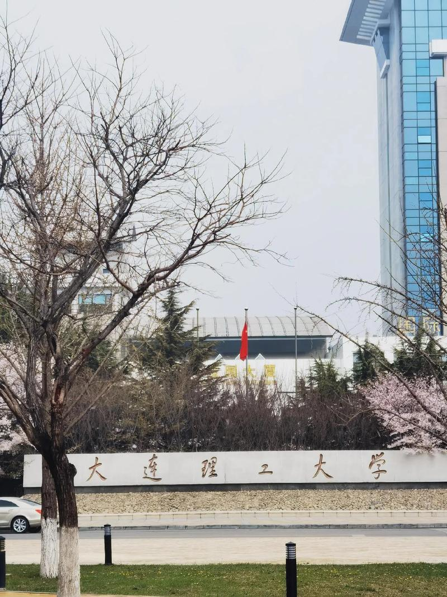
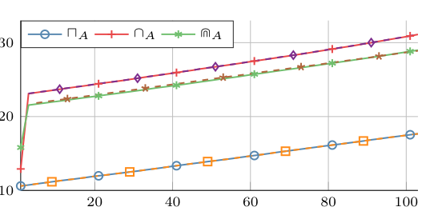
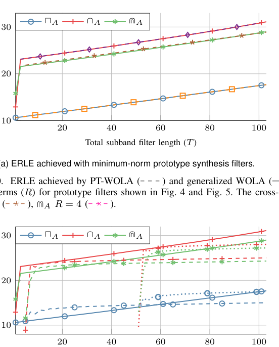
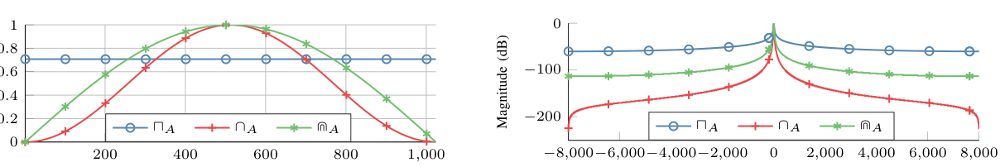
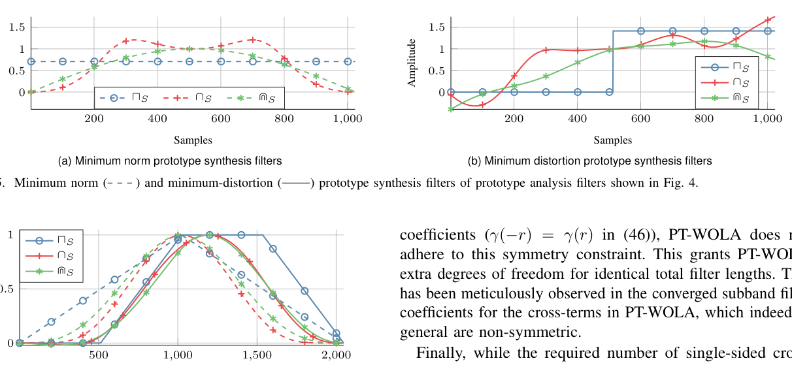

# 2511.15766v1_组会汇报

- Source: `2511.15766v1_组会汇报.pptx`
- Total slides: 13

## Slide 1

- 广义 WOLA 滤波器组
- 提升子带系统辨识

Sharma 等 · 2511.15766

### Speaker Notes

开场先给结论：这篇论文不是单纯增加滤波器阶数，而是重新安排子带滤波器的位置，使满带建模自由度恢复。来源：论文摘要与引言。

## Slide 2

|

PART 01

研究问题

### Speaker Notes

这一节提出组会需要回答的问题：传统 WOLA 为什么有效率但不够准确？

## Slide 3

一

传统 WOLA 的效率来自一个硬约束

- 传统 WOLA 以低复杂度换取可实现性。
- • 子带滤波在降采样率执行，适合长脉冲响应系统。
- • 多速率变换后，满速率滤波器被限制为 Cₖ(zᴰ)：系数之间插入 D−1 个零。
- • 稀疏结构锁死了跨帧建模自由度，难以准确逼近真实系统。
- 关键矛盾：精度需要更多自由度，而更多自由度又会推高计算量。

Sharma 等 · 2511.15766

### Speaker Notes

讲 Fig. 1：传统 WOLA 把子带滤波放在降采样率。强调稀疏 Cₖ(zᴰ) 结构带来的零系数。图中原型滤波器来自论文 Fig. 4。

## Slide 4

一

问题不只是实现，而是两类误差叠加

- 论文把传统方案的瓶颈拆成两类误差：
- • 失真误差：STFT 与循环卷积使估计的满带响应偏离真实系统。
- • 子带混叠：分析/合成原型滤波器与降采样共同引入别名项。
- 已有工作往往只减少混叠，或用额外约束补偿循环失真；但缺少从时域系统辨识角度对 T、L、D 与原型滤波器的统一分析。
- 论文目标：同时释放建模自由度，并量化 MSE/ERLE。

失真 / 混叠

### Speaker Notes

这里把瓶颈归纳为失真和混叠两类，并说明论文的理论分析要把 T、L、D 和原型滤波器放在同一框架中。

## Slide 5

|

PART 02

广义 WOLA

### Speaker Notes

过渡到方法：论文的贡献不是另加一个补丁，而是把滤波器重新放回满速率路径。

## Slide 6

二

广义 WOLA：释放满带自由度

- 核心改动只有一个：把子带滤波器移到降采样之前。
- 传统：Cₖ(zᴰ)（稀疏）
- 广义：Cₖ(z)（不再受零点约束）
- 每个子带因此拥有完整的 T 阶 FIR 自由度，同时通过完美重构的分析/合成滤波器保持整体框架。
- 代价也很明确：满速率处理需要 T 次窗口化 IDFT，复杂度从“可接受”变成“难以直接部署”。

广义 WOLA · Cₖ(z)

### Speaker Notes

讲 Fig. 2：广义 WOLA 的核心是 Cₖ(z) 不再被稀疏化。然后立刻指出计算代价是每帧 T 次窗口化 IDFT。

## Slide 7

二

MSE / ERLE 由四个设计变量共同决定

- 广义 WOLA 的稳态性能不是单一参数决定的：
- • 子带阶数 T：增大 T，满带建模误差下降。
- • 系统长度 L：L 越长，低阶子带滤波器越难覆盖。
- • 抽取因子 D：改变混叠项数量与整体延迟。
- • 原型分析/合成滤波器：决定频率选择性与循环卷积失真。
- 结论不是“阶数越大越好”，而是在失真与混叠之间寻找平衡。

理论变量 · T、L、D

### Speaker Notes

解释理论结论时只需抓住四个变量。重点不是记公式，而是理解性能由建模自由度、系统长度、抽取和原型滤波器共同塑造。

## Slide 8

二

PT-WOLA：用结构化近似把复杂度拉回可部署范围

- PT-WOLA 将广义 WOLA 的计算拆成更便宜的组合：
- • 广义 WOLA：每帧 T 次窗口化 IDFT。
- • PT-WOLA：1 次非窗口化 IDFT + T−1 个差分项 + 2R 个跨子带项。
- • 典型 N ≫ T 时，复杂度近似 O(N log₂N)，与传统 WOLA 同阶。
- R 由原型分析窗决定：矩形窗 R=0、余弦窗 R=1、root-Hann 需要更多项。

PT-WOLA · 低复杂度

### Speaker Notes

讲 Fig. 3：PT-WOLA 用一次 IDFT、差分项和 cross-terms 近似窗口化输入。R 是可调旋钮，决定 aliasing 与 distortion 的折中。

## Slide 9

|

PART 03

AEC 仿真与结果

### Speaker Notes

实验部分先说明评价环境：AEC 是一个具有长 RIR 的实际系统辨识场景。

## Slide 10

三

实验设置：用单通道 AEC 检验系统辨识

- AEC 作为系统辨识用例：
- • L=512，fs=16 kHz；N=1024，50% overlap。
- • RLS：λ=0.999，EBR=20 dB。
- • 三种分析窗：rectangular / cosine / root-Hann。
- • 两类合成窗：minimum-norm / minimum-distortion。
- 评价：system distance + ERLE。

AEC · L=512

### Speaker Notes

讲参数与评价指标，说明为什么同时看 system distance 和 ERLE：前者看模型像不像真实 RIR，后者看回声压制效果。

## Slide 11

三

广义 WOLA 的性能随阶数上升而改善

- 实验支持理论分析：
- • T 增大 → system distance 下降、ERLE 上升。
- • minimum-distortion 在各窗、各阶数下优于 minimum-norm。
- • 矩形窗频率选择性弱，更易受混叠与收敛影响。
- 要点：合成滤波器设计也是性能变量。

Evidence · larger T

### Speaker Notes

先看 generalized WOLA：T 增大带来更好的 system distance / ERLE，minimum-distortion synthesis 更稳定。

## Slide 12

三

PT-WOLA 把性能—复杂度变成可调旋钮

- 相同总滤波器长度下，PT-WOLA 可逼近 generalized WOLA。
- • cosine：少量 cross-terms 即可。
- • rectangular：增加 cross-terms 能压低混叠，但受失真瓶颈限制。
- • root-Hann：minimum-distortion 更易逼近广义方案。
- 结论：性能—复杂度可调。

性能 / 复杂度

### Speaker Notes

最后比较 PT-WOLA：合适的 cross-terms 可以在接近传统复杂度下追平 generalized WOLA；原型窗决定需要多少项。

## Slide 13

谢谢聆听！

组会论文汇报 · 欢迎讨论

### Speaker Notes

收束到三句话：释放自由度、量化误差来源、用 PT-WOLA 重新获得可部署性。最后可引出多通道空间滤波的后续方向。
